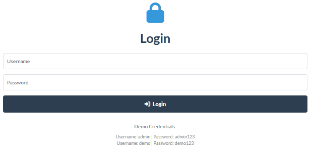

# 🔍 Real-Time Sentiment Analysis Dashboard

[](https://www.python.org/)
[](https://huggingface.co/transformers/)
[](https://dash.plotly.com/)
[](https://www.docker.com/)
[](LICENSE)

A production-ready sentiment analysis dashboard that analyzes real-time news data using state-of-the-art AI models. Built with Python, Hugging Face Transformers, and Plotly Dash.

<!-- Replace YOUR_GITHUB_USERNAME with your actual GitHub username -->
**🌐 Live Demo:** [https://YOUR-APP-NAME.onrender.com](https://YOUR-APP-NAME.onrender.com)

## 📸 Screenshots

### Login Page


### Dashboard Overview


### Sentiment Distribution


### Sentiment Score Distribution


### Sentiment Timeline


### Word Cloud Analysis


## ✨ Features

### 🤖 AI-Powered Analysis
- **DistilBERT Model** - Fast and accurate sentiment classification using Hugging Face Transformers
- **Batch Processing** - Efficient analysis of large datasets
- **Smart Caching** - Reduces API calls and improves performance

### 📊 Interactive Visualizations
- **Sentiment Distribution** - Pie chart showing positive/negative/neutral breakdown
- **Timeline Analysis** - Track sentiment trends over time
- **Score Distribution** - Histogram of sentiment scores
- **Word Clouds** - Visual representation of frequently used words

### 🔐 Authentication & Security
- **User Authentication** - Secure login/logout system
- **Session Management** - Persistent user sessions
- **YAML Configuration** - Centralized config management

### 🚀 Production Ready
- **Docker Support** - Containerized for easy deployment
- **API Integration** - News API for real-time data
- **Error Handling** - Comprehensive error management
- **Logging** - Detailed logging for debugging

## 🛠️ Tech Stack

| Component | Technology |
|-----------|-----------|
| **Backend** | Python 3.11+ |
| **ML Framework** | Hugging Face Transformers |
| **Model** | DistilBERT (distilbert-base-uncased-finetuned-sst-2-english) |
| **Dashboard** | Plotly Dash + Bootstrap |
| **Data Source** | News API |
| **Caching** | DiskCache |
| **Deployment** | Docker + Docker Compose |
| **Authentication** | Flask-Login |

## 📋 Prerequisites

- Python 3.11 or higher
- Docker Desktop (for containerized deployment)
- News API key ([Get it here](https://newsapi.org/))
- 4GB RAM minimum (8GB recommended)

## 🚀 Quick Start

### Option 1: Docker (Recommended)

```bash
# Clone the repository
git clone https://github.com/YOUR_GITHUB_USERNAME/sentiment-analysis-dashboard.git
cd sentiment-analysis-dashboard

# Create .env file with your API key
echo "NEWS_API_KEY=your_api_key_here" > .env

# Build and run with Docker Compose
docker-compose up --build
```

Open browser: **http://localhost:8050**

**Default Credentials:**
- Username: `admin` | Password: `admin123`
- Username: `demo` | Password: `demo123`

### Option 2: Local Installation

```bash
# Clone repository
git clone https://github.com/YOUR_GITHUB_USERNAME/sentiment-analysis-dashboard.git
cd sentiment-analysis-dashboard

# Create virtual environment
python -m venv venv

# Activate virtual environment
# Windows:
venv\Scripts\activate
# Linux/Mac:
source venv/bin/activate

# Install dependencies
pip install -r requirements.txt

# Create .env file
cp .env.example .env
# Edit .env and add your NEWS_API_KEY

# Run the dashboard
python app/dashboard.py
```

Open browser: **http://localhost:8050**

## 📖 Usage

### Basic Usage

1. **Login** with provided credentials
2. **Enter search query** (e.g., "artificial intelligence", "climate change")
3. **Set max results** (10-100 articles)
4. **Click "Analyze Sentiment"**
5. **Explore visualizations** in different tabs

### Search Query Examples

- `"artificial intelligence"` - Tech trends
- `"climate change"` - Environmental news
- `"cryptocurrency"` - Financial sentiment
- `"remote work"` - Business trends
- Your company or product name

## 🏗️ Project Structure

```
sentiment-dashboard/
├── app/
│   ├── data_collector.py      # News API integration
│   ├── sentiment_analyzer.py  # ML sentiment analysis
│   ├── dashboard.py           # Dash UI & callbacks
│   └── auth.py                # Authentication logic
├── config/
│   └── config.yaml            # Configuration settings
├── data/
│   ├── cache/                 # API response cache
│   └── logs/                  # Application logs
├── models/                    # Stored ML models
├── screenshots/               # Project screenshots
├── .env                       # Environment variables
├── .env.example               # Environment template
├── .gitignore                 # Git ignore rules
├── Dockerfile                 # Docker configuration
├── docker-compose.yml         # Docker Compose config
├── requirements.txt           # Python dependencies
├── LICENSE                    # MIT License
└── README.md                  # This file
```

## 🔧 Configuration

Edit `config/config.yaml` to customize:

```yaml
app:
  name: "Sentiment Analysis Dashboard"
  version: "1.0.0"

authentication:
  enabled: true
  session_timeout: 3600

users:
  admin: "admin123"
  demo: "demo123"

model:
  name: "distilbert-base-uncased-finetuned-sst-2-english"
  batch_size: 10

cache:
  enabled: true
  ttl: 3600
```

## 🐳 Docker Deployment

### Build Image

```bash
docker build -t sentiment-dashboard .
```

### Run Container

```bash
docker run -p 8050:8050 --env-file .env -e HOST=0.0.0.0 sentiment-dashboard
```

### Using Docker Compose

```bash
# Start
docker-compose up -d

# Stop
docker-compose down

# View logs
docker-compose logs -f
```

## 🌐 Cloud Deployment

### Deploy to Render (Free)

1. Fork this repository
2. Create account on [Render](https://render.com/)
3. Click **"New +"** → **"Web Service"**
4. Connect your GitHub repository
5. Configure:
   - **Name:** sentiment-analysis-dashboard
   - **Environment:** Docker
   - **Instance Type:** Free
6. Add Environment Variable:
   - Key: `NEWS_API_KEY`
   - Value: Your API key
7. Click **"Create Web Service"**
8. Wait 5-10 minutes for deployment

**Your app will be live at:** `https://your-app-name.onrender.com`

### Deploy to Railway (Free)

1. Fork this repository
2. Create account on [Railway](https://railway.app/)
3. Click **"New Project"** → **"Deploy from GitHub repo"**
4. Select your repository
5. Add environment variable: `NEWS_API_KEY`
6. Deploy!

### Deploy to Heroku

```bash
# Install Heroku CLI
heroku login

# Create app
heroku create your-app-name

# Set environment variable
heroku config:set NEWS_API_KEY=your_api_key

# Deploy
git push heroku main
```

## 📊 Performance

- **Analysis Speed**: ~10-15 seconds for 100 articles
- **Model Accuracy**: 91%+ on SST-2 benchmark
- **Cache Hit Rate**: 10x faster for repeated queries
- **Memory Usage**: ~500MB with model loaded

## 🔑 API Keys Setup

### News API

1. Visit [NewsAPI.org](https://newsapi.org/register)
2. Sign up for free account
3. Copy your API key
4. Add to `.env` file: `NEWS_API_KEY=your_key_here`
5. Free tier: 100 requests/day

## 🤝 Contributing

Contributions are welcome! Please follow these steps:

1. Fork the repository
2. Create feature branch (`git checkout -b feature/AmazingFeature`)
3. Commit changes (`git commit -m 'Add AmazingFeature'`)
4. Push to branch (`git push origin feature/AmazingFeature`)
5. Open Pull Request

## 📝 License

This project is licensed under the MIT License - see the [LICENSE](LICENSE) file for details.

## 🙏 Acknowledgments

- [Hugging Face](https://huggingface.co/) for Transformers library
- [Plotly](https://plotly.com/) for visualization tools
- [News API](https://newsapi.org/) for data access
- [DistilBERT](https://arxiv.org/abs/1910.01108) paper authors

## 📧 Contact

<!-- Replace with your actual information -->

**GitHub:** [@Sumittt2004](https://github.com/sumittt2004)

**LinkedIn:** [Sumit Mishra](https://www.linkedin.com/in/mishra-sumit-/)


**⭐ If you found this project helpful, please give it a star!**
